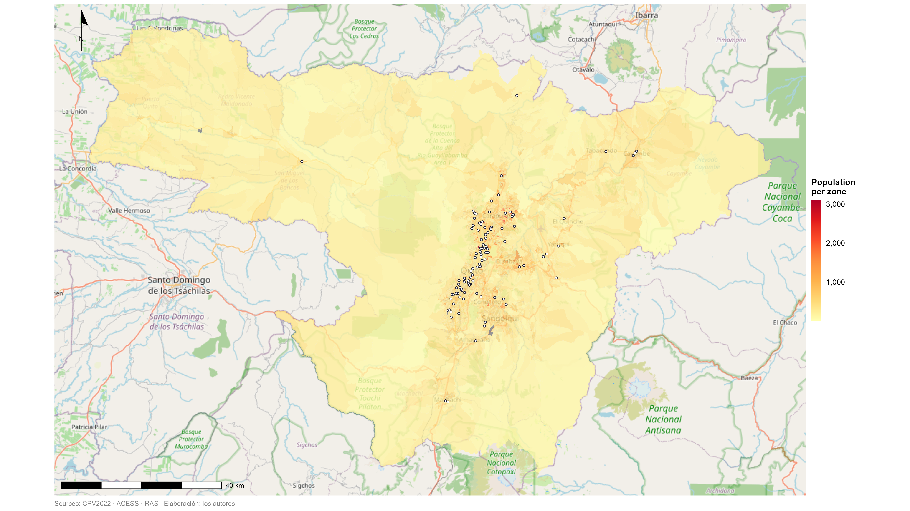
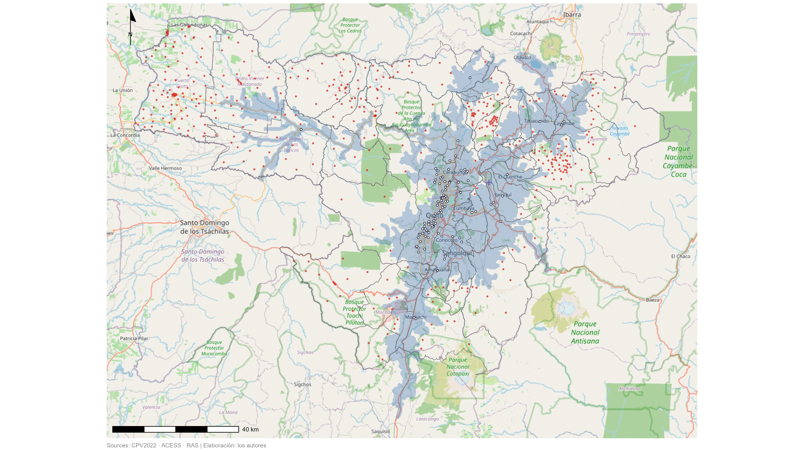
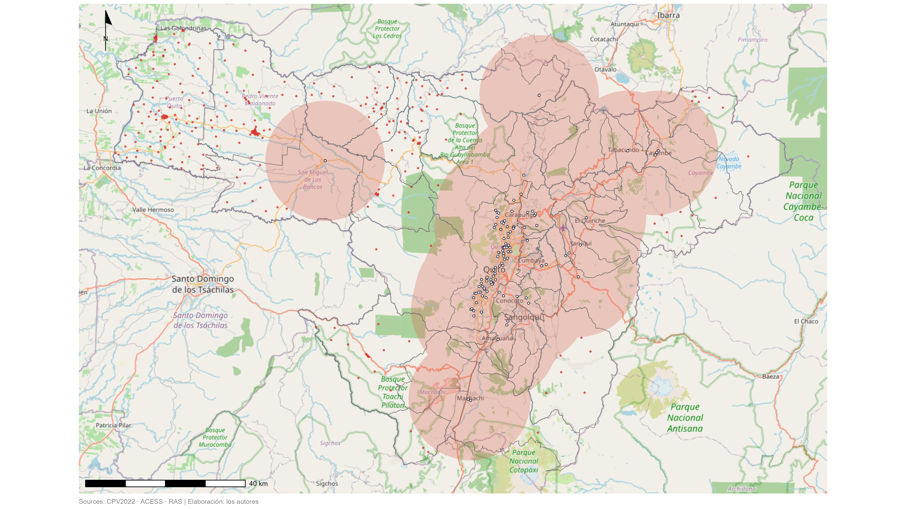
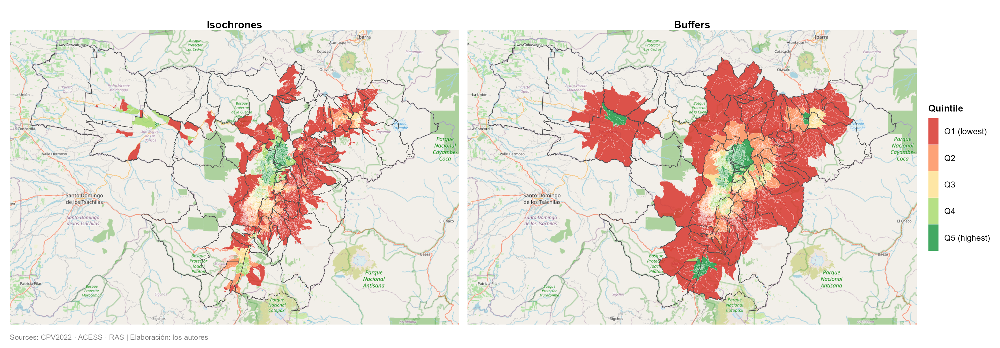

## Overview {.center}

This presentation summarizes the spatial analysis of access to health facilities
using two approaches: **isochrones** (travel-time catchments) and **buffers** (fixed-radius catchments).

Data sources: CPV2022 · ACESS · RAS


## The Ecuadorian Health System (SNS)

:::: {.columns}
::: {.column width="50%"}
**🏥 Three levels of care**

- **Level 1 — Primary care**: health posts, health centers (types A, B, C). First point of contact, preventive and basic curative care
- **Level 2 — Ambulatory specialties & hospitalization**: general hospitals, basic specialty hospitals
- **Level 3 — High complexity**: specialty and reference hospitals

:::
::: {.column width="50%"}
**📍 This study focuses on Level 1**

- Primary care is the **gateway** to the health system
- **117 georeferenced facilities** within the study area
- Operated by MSP, IESS, ISSFA, ISSPOL and private providers
- Level 1 and 2 covers 95% of the health problems in Ecuador

:::
::::


## Population and health facilities distribution

{width=100%}

## Population Distribution

:::: {.columns}
::: {.column width="65%"}

```{=html}
<iframe src="output/tables/01_poblacion.html" width="800%" height="450px" style="border:none;"></iframe>
```

:::
::: {.column width="35%"}

- Dense zones contain up to 150 housing units; dispersed zones contain up to 80 housing units
- The map shows a relatively homogeneous spatial distribution of population across zones
:::
::::

> The unit of analysis is the census zone as defined in the CPV cartography

## Specialties at primary care level

:::: {.columns}
::: {.column width="65%"}


**Why these specialties at primary care level?**

The six specialties reflect the **epidemiological and demographic profile** of the Ecuadorian population attending Level 1 facilities:

- 🩺 **General & Family medicine** — First contact for acute and chronic conditions; most frequent reason for consultation across all age groups
- 👶 **Pediatrics** — Children under 5 represent a high-demand group; priority for growth monitoring, vaccination and acute respiratory/diarrheal disease
- 🤰 **OB-GYN** — Prenatal care, family planning and reproductive health are core primary care functions; women of reproductive age (15–49) are a major user group
- 🦷 **Dentistry** — Dental caries and periodontal disease rank among the top 10 causes of morbidity in Ecuador across all age groups
- 💊 **Internal medicine** — Management of chronic non-communicable diseases (hypertension, diabetes, obesity) which concentrate in adults 40+ and require ongoing primary care follow-up

:::
::: {.column width="35%"}


```{=html}
<iframe src="output/tables/03_medicos.html" width="100%" height="600px" style="border:none;"></iframe>
```

:::
::::

## Catchment Area Comparison

{width=100%}


## Coverage by Isochrones

{width=100%}

## 🗺️ Isochrones — How They Work

:::: {.columns}
::: {.column width="50%"}
**What is an isochrone?**

- A polygon representing **all points reachable from a facility within a given travel time**
- Built using the **HERE Isoline Routing API v8** — an HTTP REST service that calculates isolines based on time, distance or vehicle charge
- The result is a polygon where each point can be reached within the provided limit
- The API incorporates real-time and historical traffic in its calculations

**In this study**

- Bands: **0–10 min**, **10–20 min**, **20–30 min** by car
- Applied to all **117 primary care facilities** in the study area

:::
::: {.column width="50%"}
**⚠️ Limitations in Ecuador**

- HERE does not offer public transport isochrones — results reflect **car travel only**, which may overestimate access for low-income populations
- Road network quality in HERE depends on OSM and licensed data — **rural and peri-urban roads in Ecuador may be incomplete or outdated**
- Isochrones assume **free-flow or average traffic** — they do not capture informal transport, footpaths, or actual travel behavior
- **Pico y placa** restrictions in Quito are not reflected in the routing model

:::
::::

## Coverage by Buffers 

{width=100%}

## ⭕ Buffers — How They Work

:::: {.columns}
::: {.column width="50%"}
**What is a buffer?**

- A circle of **fixed radius** drawn around each facility, regardless of the road network
- Represents **Euclidean distance** — straight line from the facility, not actual travel paths
- Simple to compute and fully reproducible without external APIs
- Bands: **0–5 km**, **5–10 km**, **10–15 km**
- Applied to all **117 primary care facilities** in the study area

:::
::: {.column width="50%"}
**⚠️ Limitations**

- **Ignores road network** — a facility 3 km away may be unreachable due to mountains, rivers or lack of roads
- **Overestimates coverage** in rural and peri-urban areas where terrain is irregular
- Does not account for **travel time, transport mode or population mobility patterns**
- Circles **overlap heavily** in dense urban areas, making it harder to assign population to a single facility
- Used as a **methodological baseline** for comparison against isochrone results

:::
::::


## 📊 Catchment Coverage: Zones and Population


```{=html}
<iframe src="output/tables/04_cobertura.html" width="100%" height="400px" style="border:none;"></iframe>
```

- Both methods achieve high nominal coverage — over 94% of census zones fall within at least one catchment area
- Isochrones leave 459 zones and ~96,000 people outside coverage — roughly 3.1% of the population
- Buffers perform slightly better on paper: only 283 zones and ~62,500 people outside — 2.0% of the population


## 📐 Accessibility Index — E2SFCA Method

:::: {.columns}
::: {.column width="52%"}
**Step 1 — Supply ratio per facility**

For each facility $j$, calculate the doctor-to-population ratio within its catchment:

$$R_j = \frac{S_j}{\sum_{k \in \{d_{kj} \leq d_0\}} W_z \cdot P_k}$$

- $S_j$ = doctors at facility $j$
- $P_k$ = population at zone $k$
- $W_z$ = distance decay weight by travel time band
  - Band 0–10 min → $W = 1.0$
  - Band 10–20 min → $W = 0.48$
  - Band 20–30 min → $W = 0.05$

**Step 2 — Accessibility score per zone**

For each census zone $i$, sum the ratios of all facilities within reach:

$$A_i = \sum_{j \in \{d_{ij} \leq d_0\}} W_z \cdot R_j$$

:::
::: {.column width="48%"}
**Why divide by the regional mean? 🤔**

- The raw $A_i$ score is a **doctors-per-person ratio** — small, hard to interpret
- Dividing by the **regional mean** $\bar{A}$ produces a **relative index**:

$$I_i = \frac{A_i}{\bar{A}}$$

- $I_i = 1.0$ → zone has **average access** for the region
- $I_i > 1.0$ → zone has **above-average access**
- $I_i < 1.0$ → zone has **below-average access**

This makes results **directly comparable** across zones, time periods, and study areas — without needing to interpret raw doctor ratios

:::
::::


## Accessibility Index — Isochrones

{width=100%}
## Summary by Isochrones

```{=html}
<iframe src="output/tables/05_indice_resumen.html" width="100%" height="280px" style="border:none;"></iframe>
```

## Accessibility Index — Buffers

{width=100%}

## Summary 

```{=html}
<iframe src="output/tables/06_quintiles.html" width="100%" height="580px" style="border:none;"></iframe>
```


## Quintile Panel · Inequality

{width=100%}

## Results of coefficients

```{=html}
<iframe src="output/tables/07_coeficiente.html" width="100%" height="280px" style="border:none;"></iframe>
```


## Low Accessibility Zones

{width=100%}

## Housing — Buffer Method

{width=100%}

## Housing — Isochrone Method

{width=100%}


## 🏁 Conclusions

- **Both methods confirm high nominal coverage** — isochrones cover 94.6% of census zones (96.9% of population); buffers 96.7% (98.0%) — but buffers overestimate reachability by ignoring terrain and road network
- **~96,000 people remain outside isochrone coverage** — these 459 zones represent the most spatially isolated population and the primary target for health infrastructure investment
- **Accessibility is unequally distributed**: the bottom quintile (Q1) has a mean index of 0.28 vs. 2.10 for the top quintile (Q5) — a nearly **7x gap** between the least and most accessible zones
- **High dispersion confirms spatial inequality**: isochrone SD = 0.67, buffer SD = 0.98 — a large share of zones fall well below the regional mean of 1.0; the median (0.81 iso / 0.80 buf) is consistently below average
- **Isochrones are the more conservative and realistic method** — lower max values (3.28 vs 4.58) and tighter SD reflect actual road-network constraints rather than geometric approximation
- **Results provide an evidence base** for targeted primary care expansion, particularly in zones classified in Q1 and Q2 of the accessibility index


## {.center}

::: {style="font-size: 1.4em; text-align: center;"}
**Thank you**

*Questions & Discussion*
:::

::: {style="font-size: 0.8em; text-align: center; margin-top: 2em; color: grey;"}
Sources: CPV2022 · ACESS · RAS | Elaboración: los autores
:::
